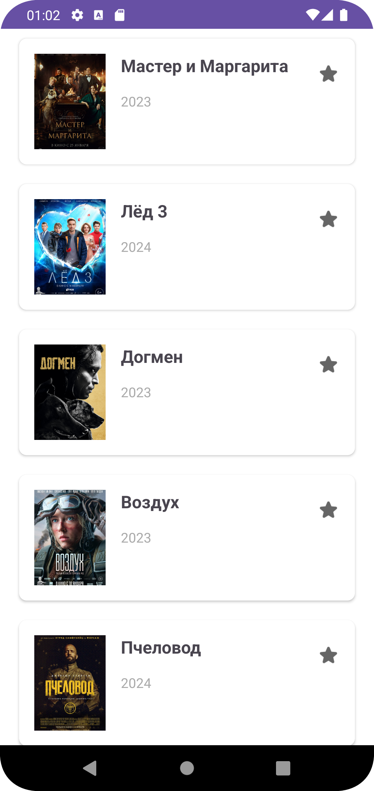

# Ainkino App

The Ainkino app is an Android application designed to showcase popular movies using the unofficial *** API. It allows users to browse a list of popular movies and view detailed information about each movie, including title, description, genres, and country of production. Users can also mark movies as their favorites.

## Features

- **Browse Popular Movies**: Users can view a list of popular movies fetched from the *** API.
- **Movie Details**: By selecting a movie, users can view its detailed information, such as the names, poster image, year of release, genre, country, and a full description.
- **Favorites**: Users can mark movies as favorites. These selections are highlighted in the UI.

## Technical Details

### Architecture

The app is built using the Model-View-Controller (MVC) architectural pattern. It utilizes Retrofit for network calls to fetch movie data from the Kinopoisk API and Glide for image loading.

### Classes

- **`MainActivity`**: The entry point of the app that displays a list of popular movies.
- **`MovieDetailActivity`**: Displays detailed information about a selected movie.
- **`MoviesAdapter`**: A RecyclerView adapter to bind movie data to the UI.
- **`MovieService`**: Defines the Retrofit interface for API calls.

### Data Classes

- **`Movie`**: Represents a movie with basic information.
- **`MovieDetail`**: Contains detailed information about a movie.
- **`MovieResponse`**: Represents the response from the API containing a list of movies.
- **`FavoriteMovie`**: Represents a favorite movie selected by the user.

### Networking

Network requests are made to the *** API to fetch popular movies and movie details. The API key is included in the header of each request.

### Persistence

The list of favorite movies is stored in-memory and managed through the user's interaction with the UI. This list is not persisted across app restarts in the current implementation.

## Setup

To run the project:

1. Clone the repository.
2. Open the project in Android Studio.
3. Run the app on an emulator or a physical device.

Ensure you have an internet connection, as the app needs to fetch data from the *** API.

## Dependencies

- Retrofit: For making network requests.
- Gson: For JSON serialization and deserialization.
- Glide: For image loading.

## Permissions

The app requires the `INTERNET` permission to make network requests.

## Testing

The app includes a basic instrumented test to verify the application context.

## Future Improvements

- Implement persistent storage for favorite movies.
- Add more detailed error handling and loading states.
- Improve UI/UX design.
